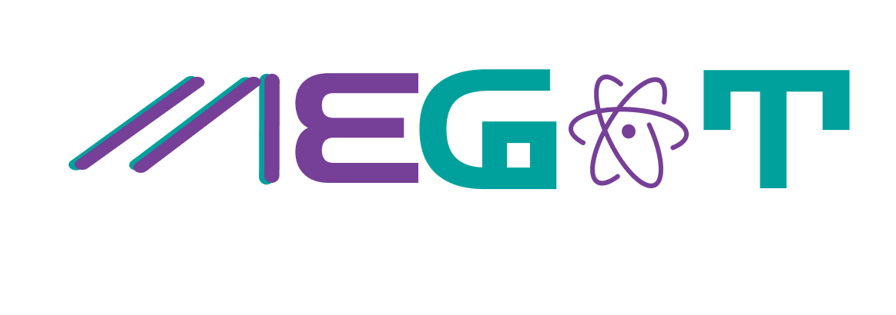

# MEGAT Kinematic Viscosity Calculator



This Streamlit application calculates the kinematic viscosity at a given temperature based on the ASTM-D341 standard equation. The app also plots the kinematic viscosity as a function of temperature in the range from 40°C to 100°C.

## Features

- Calculate kinematic viscosity at a specified temperature.
- Plot kinematic viscosity vs. temperature graph for the range 40°C to 100°C.

## Equation

The application uses the following ASTM-D341 standard equation to relate kinematic viscosity and temperature:

\[ \log(\log(v + 0.7)) = A - B \log(T) \]

Where:
- \( v \) is the kinematic viscosity in cSt.
- \( T \) is the temperature in Kelvin.

The constants \( A \) and \( B \) are calculated using two reference kinematic viscosity and temperature values:

\[ B = \frac{\log(\log(v_2 + 0.7)) - \log(\log(v_1 + 0.7))}{\log(T_1) - \log(T_2)} \]

\[ A = B \log(T_1) + \log(\log(v_1 + 0.7)) \]

## Requirements

- Python 3.7+
- Streamlit
- NumPy
- Matplotlib

## Installation

1. Clone the repository:

```sh
git clone https://github.com/yourusername/kinematic-viscosity-calculator.git
cd kinematic-viscosity-calculator
```

2. Create a virtual environment and activate it:

```sh
python -m venv venv
source venv/bin/activate  # On Windows use `venv\Scripts\activate`
```

3. Install the required packages:

```sh
pip install -r requirements.txt
```

## Usage

1. Run the Streamlit app:

```sh
streamlit run app.py
```

2. Open your web browser and navigate to `http://localhost:8501`.

3. Input the required parameters:
   -$ \( v_1 \)$: Kinematic viscosity at $\( T_1 \)$ in cSt.
   -$ \( v_2 \)$: Kinematic viscosity at $\( T_2 \)$ in cSt.
   -$ \( T_1 \)$: Temperature in °C.
   -$ \( T_2 \)$: Temperature in °C.
   - Temperature in °C for viscosity calculation.

4. Click the "Calculate Viscosity" button to compute the kinematic viscosity and display the viscosity vs. temperature graph.

## Files

- `app.py`: Main application file.
- `requirements.txt`: List of dependencies.

## License

This project is licensed under the MIT License.

## Contributing

Contributions are welcome! Please fork the repository and submit a pull request.

## Contact

For any questions or suggestions, please open an issue or contact [maercaestro@gmail.com](mailto:maercaestro@gmail.com).

 
